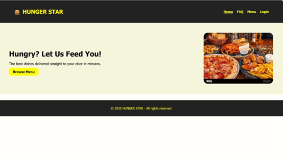
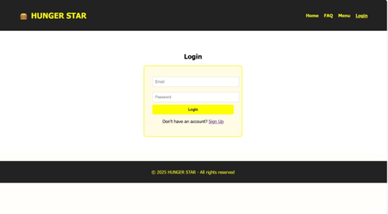
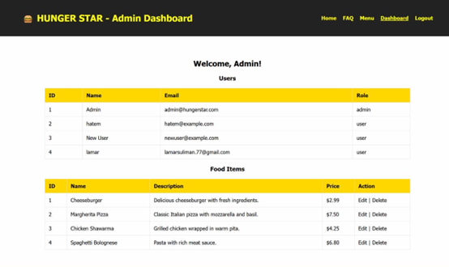

# Hunger Star - Food Ordering Website

A team project for CS486 - Web Application Development, built using:

- Frontend: HTML, CSS, JavaScript
- Backend: PHP
- Database: MySQL (via XAMPP)

## Features:
- User authentication (Login & Signup)
- Admin dashboard
- Dynamic content updates
- Order management

## Team Members:
- Lina Askar
- Watin Alatiah
- Najla Almaghlouth
- Lamar Almutairi
- Lamia Alghamdi

## Screenshots:

### Home Page

### Login Page

### Admin Dashboard

## How to Run:
1. Open project in XAMPP
2. Import the database file (`hungerstar.sql`) into phpMyAdmin using the "Import" tab
3. Start Apache and MySQL from XAMPP, then open `http://localhost/hungerstar` in your browser
